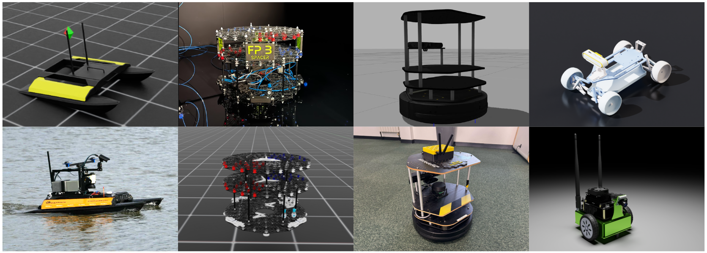
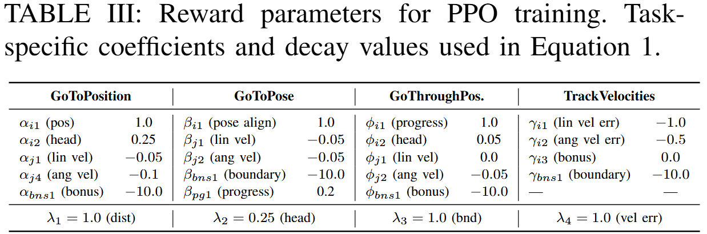
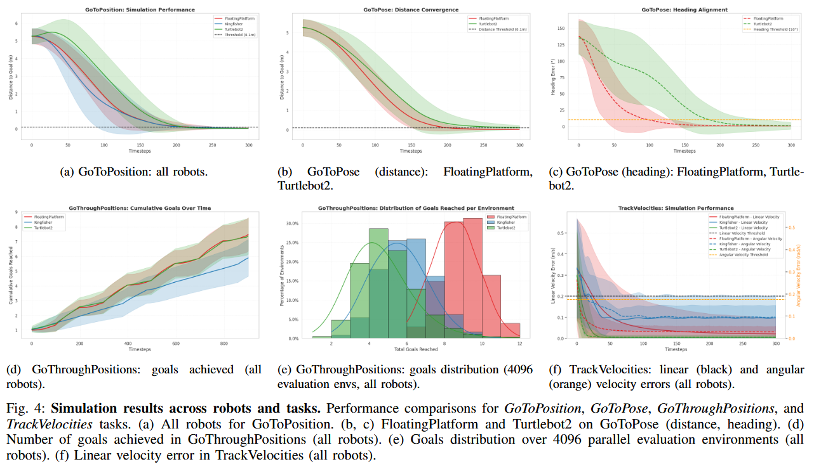
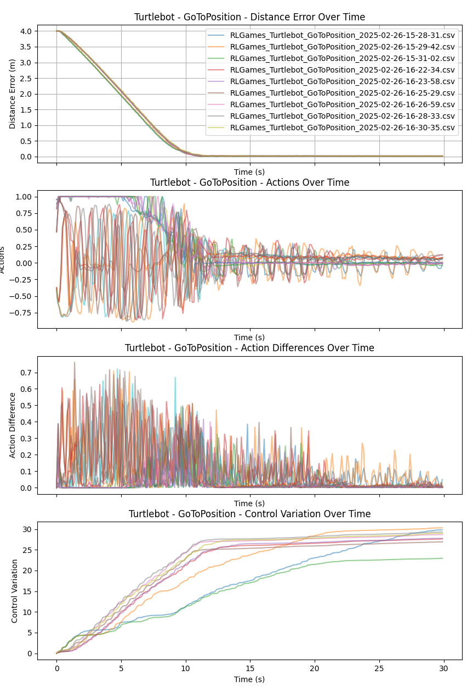
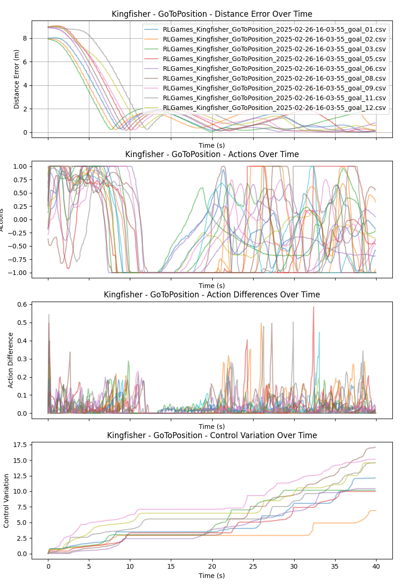
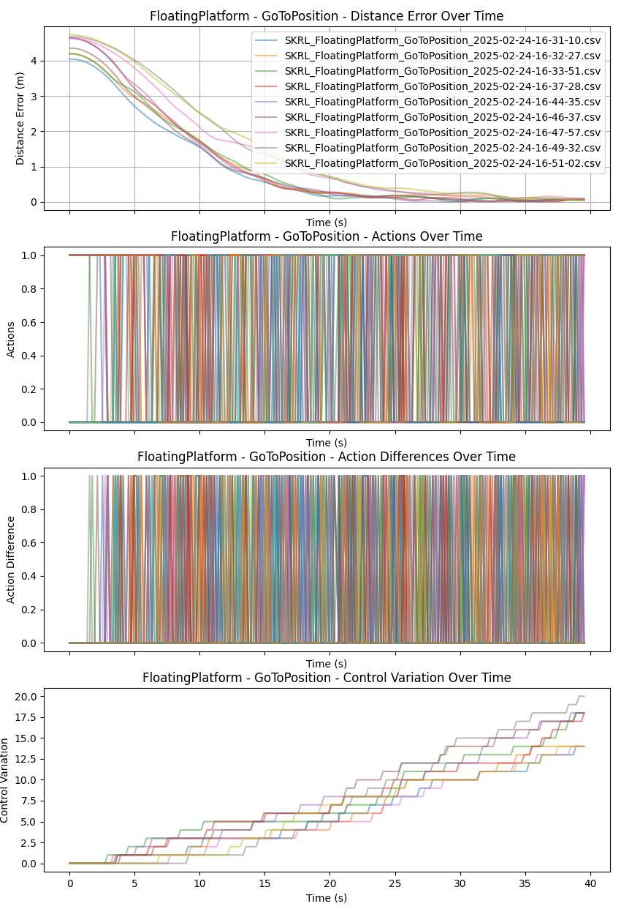

# NavBench Website
*A Unified Robotics Benchmark for Reinforcement Learning-Based Autonomous Navigation.*

[](https://docs.isaacsim.omniverse.nvidia.com/latest/index.html)
[](https://docs.python.org/3/whatsnew/3.10.html)
[](https://releases.ubuntu.com/20.04/)
[](https://www.microsoft.com/en-us/)
[](https://github.com/isaac-sim/IsaacLab/actions/workflows/pre-commit.yaml)
[](https://opensource.org/licenses/BSD-3-Clause)
[](https://opensource.org/license/apache-2-0)

<!-- [](INSERT_ARXIV_LINK)
[](INSERT_WEBSITE_LINK)   -->

This is a landing page for all the projects related to NavBench. Below there's the links to the code of each project:

Main Code (RAL Submission)
- [](https://anonymous.4open.science/r/NavBench-Code-E08E/README.md)

Overview
-
NavBench is a **multi-domain reinforcement learning benchmark** designed for robotic navigation tasks in **terrestrial, aquatic, and space environments**. Built on [IsaacLab](https://isaac-sim.github.io/IsaacLab), our framework enables:

✅ **Fair comparisons** across different robots and mobility systems
✅ **Scalable training pipelines** for reinforcement learning agents
✅ **Sim-to-real transfer validation** on physical robots


Features
-
- **Diverse Navigation Tasks**: `GoToPosition`, `GoToPose`, `GoThroughPositions`, `TrackVelocities`, and more.
- **Cross-Domain Evaluation**: Supports thruster-based platforms, wheeled robots, and water-based propulsion.
- **Unified Task Definitions**: Standardized observation space, reward structures, and evaluation metrics.
- **Efficient Simulation**: GPU-accelerated rollouts via IsaacLab for rapid RL training.
- **Real-World Validation**: Policies successfully deployed on a Floating Platform, Kingfisher, and Turtlebot2.


🚧 Installation
-
Code lives in this anonymous [repo](https://anonymous.4open.science/r/NavBench-Code-E08E/README.md):
```
git clone https://anonymous.4open.science/r/NavBench-Code-E08E/README.md
cd NavBench-Code
./docker/container.py start
./docker/container.py enter
```

Reproducibility
-
### 🧠 Training pipelines for all tasks and robots
```
./isaaclab.sh -p scripts/reinforcement_learning/<isaac_lab_rl_framework>/train.py --task=Isaac-RANS-Single-v0 --headless env.robot_name=<robot_name> env.task_name=<task>
```
#### Robots
| Land              | Water            | Space                 |
| :---------------- | :--------------: | :-------------------: |
| Jetbot            |   Kingfisher     |   FloatingPlatform    |
| Leatherback       |
| Turtlebot2        |

#### Tasks
- GoToPosition
- GoToPose
- GoThroughPositions
- TrackVelocities

>[!Note]
> The paper was tested using SKRL and RL_Games for the `isaac_lab_rl_framework`.

<div align="center">
  
</div>

### PPO Hyperparameters


| Parameter         | Value    |
| :---------------- | :------: |
| Rollouts          |   32     |
| Learning Epochs   |   8      |
| Mini Batches      |  8       |
| Discount Factor   |  0.99    |
| Lambda            |  0.95    |
| Learning Rate     |  5.0e-04 |
| KL Threshold      |  0.016   |
| Epochs            |  1000    |
| Network size      |  32x32   |

### 🧪 Evaluation and visualization
Play trained models
```
./isaaclab.sh -p scripts/reinforcement_learning/<isaac_lab_rl_framework>/play.py --task=Isaac-RANS-Single-v0 --num_envs=32 env.robot_name=<robot_name> env.task_name=<task> --checkpoint=<path_to_pt_model>
```
Evaluation & Metrics
```
```
<div align="center">
  
</div>

Success Rate on multiple frameworks
| Task |	Robot	| rl_games | skrl |
| :---- | :------ | --------: | ----: |
| GoThroughPositions |	FloatingPlatform	| 1.000 |	1.000 |
| GoThroughPositions |	Kingfisher	| 0.994 |	1.000 |
| GoThroughPositions |	Turtlebot2	| 1.000 |	1.000 |
| GoToPose |	FloatingPlatform	| 1.000 |	0.999 |
| GoToPose |	Kingfisher	| 0.827 |	0.898 |
| GoToPose |	Turtlebot2	| 0.834 |	0.937 |
| GoToPosition |	FloatingPlatform	| 0.997 |	1.000 |
| GoToPosition |	Kingfisher	| 0.997 |	0.600 |
| GoToPosition |	Turtlebot2	| 0.991 |	0.993 |
| TrackVelocities |	FloatingPlatform	| 0.885 |	0.968 |
| TrackVelocities |	Kingfisher	| 0.992 |	1.000 |
| TrackVelocities |	Turtlebot2	| 0.999 |	1.000 |


📊 Pre-trained models and performance metrics
-
You can download all the trained models from this [link](/models/).

### Simulation

<div align="center">
  
</div>

### Real-world

| Turtlebot 2              | Kingfisher            | Floating platform                 |
| :---------------- | :--------------: | :-------------------: |
| <div align="center"></div>            |   <div align="center"></div>     |   <div align="center"></div>    |


🎥 Real-world deployments
-

| Turtlebot 2              | Kingfisher            | Floating platform                 |
| :---------------- | :--------------: | :-------------------: |
| <div align="center"></div>            |   <div align="center"></div>     |   <div align="center"></div>    |
